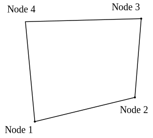
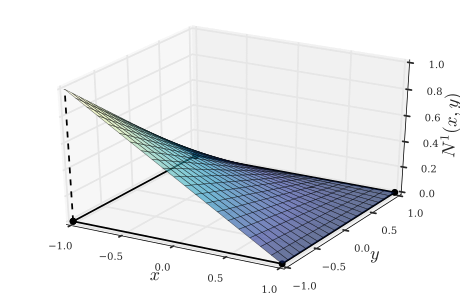
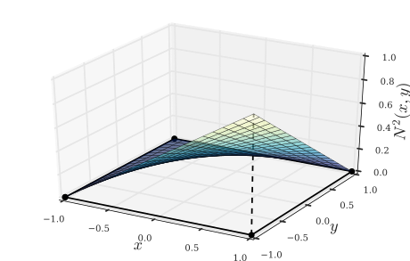
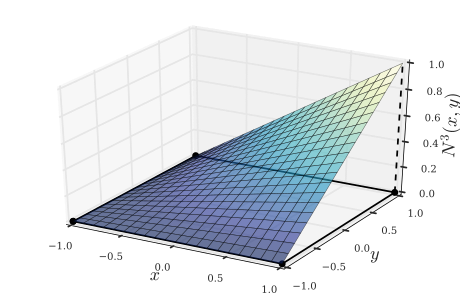
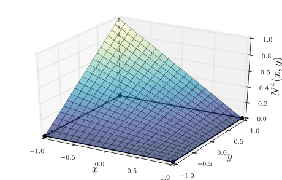

% Isoparametric elements in 2D
% Nicolás Guarín Zapata
    nguarinz@eafit.edu.co
    @nicoguaro
% Marzo 31, 2017

------------------

## Isoparametric interpolation

In an isoparametric interpolation we use the same shape functions to interpolate
our field variables and the displacements (geometry of our elements).

<table class="centObj">
<tr>
<td>

</td>
<td>

</td>
</table>

------------------

## Shape functions for a 4-nodes element

<table class="centObj">
<tr>
<td>
<figure>

<figcaption>Shape function associated with node 1.</figcaption>
</figure>
</td>
<td>
<figure>

<figcaption>Shape function associated with node 2.</figcaption>
</figure>
</td>
</tr>
<tr>
<td>
<figure>

<figcaption>Shape function associated with node 3.</figcaption>
</figure>
</td>
<td>
<figure>

<figcaption>Shape function associated with node 4.</figcaption>
</figure>
</td>
</tr>
</table>

------------------

## Displacement interpolation

Our displacements are written as

$$\left\{ {\begin{array}{*{20}{c}}
{u}\\
{v}
\end{array}} \right\} = \left[ {\begin{array}{*{20}{c}}
{{N^1}(x, y)}&0&{{N^2}(x, y)}&0&{{N^3}(x, y)}&0&{{N^4}(x, y)}&0\\
0&{{N^1}(x, y)}&0&{{N^2}(x, y)}&0&{{N^3}(x, y)}&0&{{N^4}(x, y)}
\end{array}} \right]\left\{ {\begin{array}{*{20}{c}}
{{u^1}}\\
{{u^2}}\\
{{u^3}}\\
{{u^4}}\\
{{u^5}}\\
{{u^6}}\\
{{u^7}}\\
{{u^8}}
\end{array}} \right\}$$

------------------

## Derivatives interpolation

Our displacements are written as

$$\left\{ {\begin{array}{*{20}{c}}
{\frac{{\partial u}}{{\partial x}}}\\
{\frac{{\partial v}}{{\partial y}}}\\
{\frac{{\partial v}}{{\partial x}} + \frac{{\partial u}}{{\partial y}}}
\end{array}} \right\} = \left[ {\begin{array}{*{20}{c}}
{\frac{{\partial {N^1}(x, y)}}{{\partial x}}}&0&{\frac{{\partial {N^2}(x, y)}}{{\partial x}}}&0&{\frac{{\partial {N^3}(x, y)}}{{\partial x}}}&0&{\frac{{\partial {N^4}(x, y)}}{{\partial x}}}&0\\
0&{\frac{{\partial {N^1}(x, y)}}{{\partial y}}}&0&{\frac{{\partial {N^2}(x, y)}}{{\partial y}}}&0&{\frac{{\partial {N^3}(x, y)}}{{\partial x}}}&0&{\frac{{\partial {N^4}(x, y)}}{{\partial x}}}\\
{\frac{{\partial {N^1}(x, y)}}{{\partial x}}}&{\frac{{\partial {N^1}(x, y)}}{{\partial y}}}&{\frac{{\partial {N^2}(x, y)}}{{\partial x}}}&{\frac{{\partial {N^2}(x, y)}}{{\partial y}}}&{\frac{{\partial {N^3}(x, y)}}{{\partial x}}}&{\frac{{\partial {N^3}(x, y)}}{{\partial y}}}&{\frac{{\partial {N^4}(x, y)}}{{\partial x}}}&{\frac{{\partial {N^4}(x, y)}}{{\partial y}}}
\end{array}} \right]\left\{ {\begin{array}{*{20}{c}}
{{u^1}}\\
{{u^2}}\\
{{u^3}}\\
{{u^4}}\\
{{u^5}}\\
{{u^6}}\\
{{u^7}}\\
{{u^8}}
\end{array}} \right\}$$

------------------

## Shape functions

\begin{align*}
{N^1}(x) & = \frac{1}{4}(1 - x)(1 - y) \\
{N^2}(x) & = \frac{1}{4}(1 + x)(1 - y) \\
{N^3}(x) & = \frac{1}{4}(1 + x)(1 + y) \\
{N^4}(x) & = \frac{1}{4}(1 - x)(1 + y)
\end{align*}

------------------

## Shape functions

Notice that in the computation of the stiffness matrix we actually require the spatial derivatives of the shape functions given by

\begin{align*}
\frac{{\partial {N^1}(x)}}{{\partial x}} & =  - \frac{1}{4}(1 - y)           &  \frac{{\partial {N^1}(x)}}{{\partial y}} & =  - \frac{1}{4}(1 - x)\\
\frac{{\partial {N^2}(x)}}{{\partial x}} & =  + \frac{1}{4}(1 - y)           &  \frac{{\partial {N^2}(x)}}{{\partial y}} & =  - \frac{1}{4}(1 + x)\\
\frac{{\partial {N^3}(x)}}{{\partial x}} & =  + \frac{1}{4}(1 + y)           &  \frac{{\partial {N^3}(x)}}{{\partial y}} & =  + \frac{1}{4}(1 + x)\\
\frac{{\partial {N^4}(x)}}{{\partial x}} & =  - \frac{1}{4}(1 + y)           &  \frac{{\partial {N^4}(x)}}{{\partial y}} & =  + \frac{1}{4}(1 - y)
\end{align*}

------------------

## Elemental stiffness matrix

The elemental material stiffness matrix computed in the natural domain reads

\begin{equation}
K_\text{local}=\int_{V_0} \hat{B}^T(\mathbf{r}) C \hat{B}(\mathbf{r}) dV_0(\mathbf{r})\equiv \int_{r=-1}^{r=+1}\int_{s=-1}^{s=+1} \hat{B}^T(r,s) C\hat{B}(r,s)J(r,s) \mathrm{d}r\mathrm{d}s
\end{equation}

------------------

## References

- Bathe, K. J. (2006). Finite element procedures. Klaus-Jurgen Bathe.
- Juan Gomez & Nicolás Guarín-Zapata (2017). Class Notes: Introduction to the Finite Element Methods.
